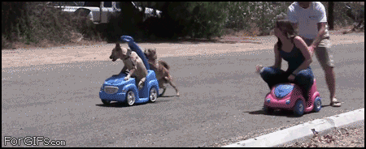

.. _doc_races:

Races
==================

There are 3 races:

#. **Race 1** tests the students' application of *reactive methods*.
#. **Race 2** tests the students' application of *pure pursuit* and *map-based* methods.
#. **Race 3** culminates to head to head racing with another team's car.

The first two races are timed trials. There are time brackets that correspond to grade brackets.

.. toctree::
   :maxdepth: 1
   :caption: Races
   :name: sec-races-intro

   race1
   race2
   race3