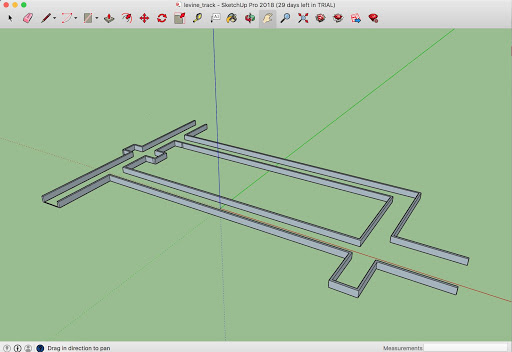

.. _doc_race1:

Race 1
======================

**Track:** You want to choose a track that is a closed loop. At Penn, we have the students race around the hallways in the Levine building. 

	The hallways on the second floor of the Levine buildling form a rectangular track.

**Race Prep:** Teams should be given the track beforehand so they can practice on their own time.

**Race Day:** View the `Race1 Rubric <https://docs.google.com/spreadsheets/d/1TVz_E3AGdg7vMDc3E5JCkMwy_1bnrjuo5goGEVQUQB8/edit#gid=0>`_ and :ref:`Grading <doc_grading>` to see how teams are evaluated. If time allows, there can be a practice session beforehand. If not, then have teams run their vehicle around the track and record each lap time and number of consecutive laps. There are two heats so teams will have two chances to complete the race. 

