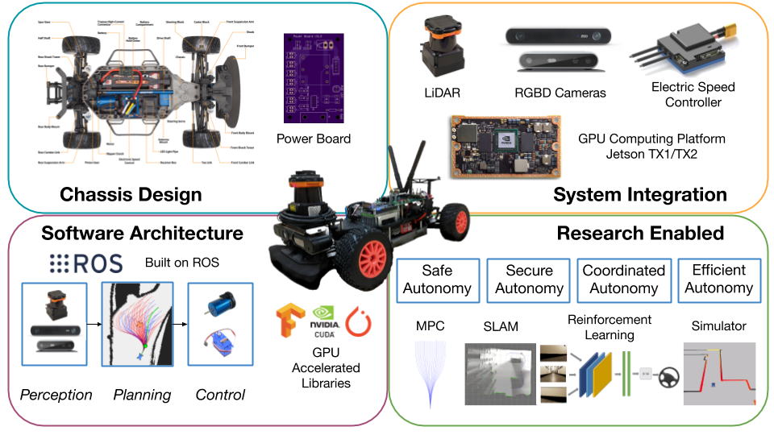

F1TENTH - Course Documentation - *stable branch*
================================================

Here, you will learn how to utilize your F1TENTH vehicle to its fullest potential!

.. important::
  
  #. If you want to immediately start learning how to utilize the F1TENTH Autonomous Vehicle System in a weekend, head over to :ref:`Crash Course <doc_crashcourse_intro>`.
  #. If you want to get to all the nitty gritty details and learn more about the F1TENTH Autonomous Vehicle System in depth, head over to :ref:`Full Course Overview <doc_overview>`.

.. note:: F1TENTH is an open source project developed by a community of
          researchers and students. The documentation team can always use your
          feedback and help to improve the tutorials and class reference. If
          you don't understand something, or cannot find what you
          are looking for in the docs, help us make the documentation better
          by letting us know!

          Submit an issue on the `GitHub repository
          <https://github.com/f1tenth/f1tenth_coursekit/issues>`_.

The table of contents below and in the sidebar should let you easily access the
documentation for your topic of interest. You can also use the search function
in the top left corner.

The main documentation for the site is organized into the following sections:

.. toctree::
   :maxdepth: 1
   :caption: Crash Course
   :name: sec-crash-course

   crash_course/intro
   crash_course/session1/session1
   crash_course/session2/session2
   crash_course/session3/session3

.. toctree::
   :maxdepth: 1
   :caption: Full Course Overview
   :name: sec-introduction

   introduction/overview
   introduction/syllabus

.. toctree::
   :maxdepth: 1
   :caption: Full Course Sessions
   :name: sec-course-sessions

   lectures/index

.. toctree::
   :maxdepth: 1
   :caption: Full Course Assignments
   :name: sec-assignments

   assignments/labs/index
   assignments/races/index
   assignments/final_project
   assignments/grading
   

.. toctree::
   :maxdepth: 1
   :caption: Support
   :name: sec-support-contact

   press/logos
   support/contact
   support/acknowledgment

.. Indices and tables
.. ------------------
..
.. * :ref:`genindex`
.. * :ref:`modindex`
.. * :ref:`search`
