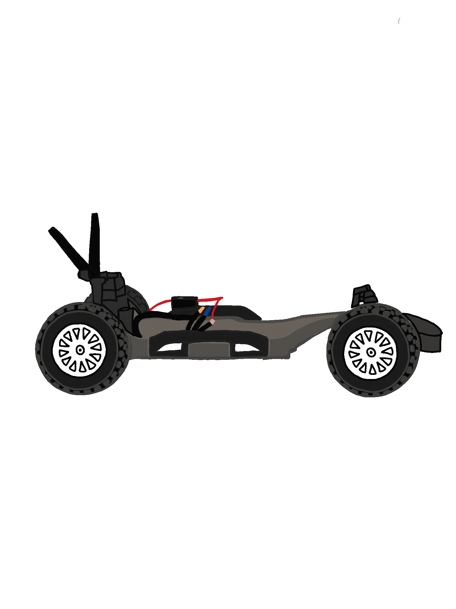

.. _doc_lecture05:

Lecture 5 - Car Building and VESC Tuning
===========================================

**Overview:** 
	This lecture is more of open lab than an actual lecture. In this lecture, students form teams of 3-4, start to build the car, and tune the VESC.

**Links to additional resources:**
	- `Build Documentation <https://f1tenth.github.io/build.html>`_ (VESC Tuning instructions can be found under **Installing Firmware > 1. Configuring the VESC**)
	- `Build Support Forum <http://f1tenth.org/forum.html>`_
	- `Connect with other F1TENTH teams from around the world <https://join.slack.com/t/f1tenth-teams/shared_invite/enQtMzc3ODU2ODM1NzE3LTBjMmVkMzZjZTJiNWUzZDFhZTJiODgzMjg0MTA1MDAxZTUxMzkwMDRhNTM2NzdjNDc5MTk5YTc5YmNhNTdhMTU>`_

..
	**Topics Covered:**
		-	Why use a simulator?
		-	How to install and use the F1TENTH simulator

	**Slides:**

		.. raw:: html

			<iframe width="700" height="500" src="https://docs.google.com/presentation/d/e/2PACX-1vRyxtmwWPULzV8Tm3ak_YgxRf5__JfL0mXa_MZDcGWBdMnjpTGAT9l_DjkEo6LtY13HauuFDziRqmCs/embed?start=false&loop=false&delayms=3000" frameborder="0" width="960" height="569" allowfullscreen="true" mozallowfullscreen="true" webkitallowfullscreen="true"></iframe>

	**Video:**

		.. raw:: html

			<iframe width="560" height="315" src="https://www.youtube.com/embed/zkMelEB3-PY" frameborder="0" allow="accelerometer; autoplay; encrypted-media; gyroscope; picture-in-picture" allowfullscreen></iframe>

	**Links to additional resources:**
		- `F1TENTH Simulator Repo <https://github.com/f1tenth/f110_ros/tree/master/f110_simulator>`_