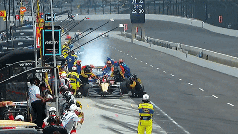

.. _doc_lecture28:

Lecture 28 - Race 3: F1TENTH Grand Prix!
第28讲 - 小测验3： F1TENTH竞速赛
======================================================

**Overview:** 
	Final race day! Teams race each other in single elimination tournament. See :ref:`Race 3 <doc_race3>` for more information on how to setup and evaluate the race.  
	最终竞速日！配置场地并评估竞赛的详细信息见文档。
